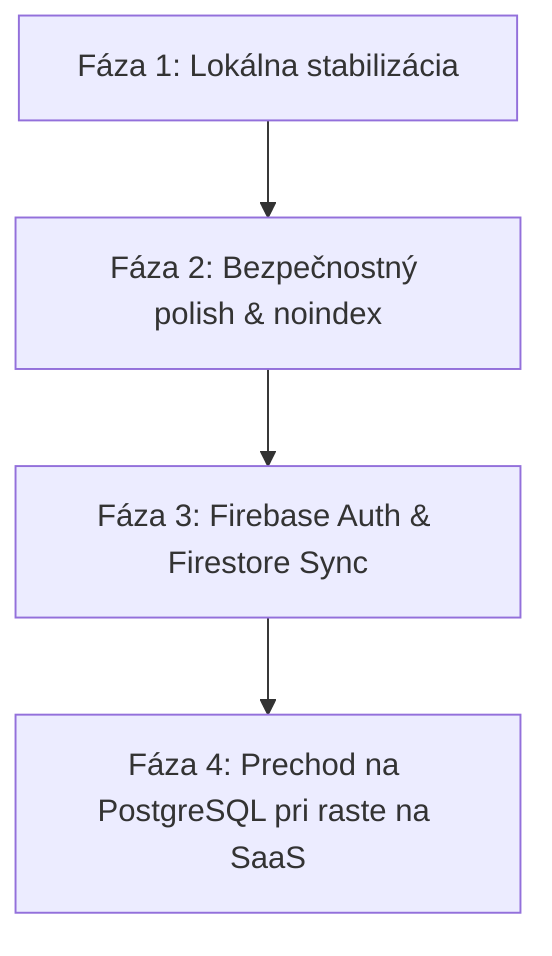

# CRM Next Phase Backend Sync Strategy

To transition our CRM from a single-device local IndexedDB to a multi-device shared team tool, we must decide on the synchronization architecture. Below is a comparison of the three primary options.

## Comparison Matrix

| Criteria | Možnosť A: Lokálny režim (Aktuálny) | Možnosť B: Firebase/Firestore | Možnosť C: PostgreSQL + Prisma |
| :--- | :--- | :--- | :--- |
| **Primárne využitie** | Osobné/interné použitie | Rýchly vývoj, PWA, reálny čas | Komplexný SaaS, enterprise riešenia |
| **Zložitosť implementácie** | Žiadna (Nulová zmena) | Nízka (Nativný offline/sync) | Vysoká (Nutnosť vlastného syncu) |
| **Multi-device / Tímy** | Nie (Dáta sú len v prehliadači) | Áno (Real-time sync) | Áno (Cez API / WebSockets) |
| **Prevádzkové náklady** | 0 € | Veľmi nízke (Bezplatný plán) | Stredné (Server / DB hosting) |
| **Správa konfliktov** | Netreba | Jednoduchá (Last write wins / Custom rules) | Zložitá (Nutný timestamping/verzie) |

---

## 1. Možnosť A: Ponechať lokálne CRM
Najjednoduchšia cesta, ak nástroj slúži iba jednému správcovi.
- **Výhody**: Žiadne prevádzkové náklady, 100% ochrana súkromia (dáta neopúšťajú počítač), žiadne sync konflikty, možnosť backupu cez JSON.
- **Nevýhody**: Nemôžu ho používať viacerí ľudia naraz, zmena prehliadača/premazanie cookies bez zálohy znamená stratu dát.

## 2. Možnosť B: Firebase / Firestore Sync (Odporúčané strednodobo)
Najvhodnejšia cesta pre Nexify Studio. Firebase Firestore je od základu navrhnutý ako offline-first databáza s automatickou synchronizáciou.
- **Výhody**:
  - Out-of-the-box podpora offline zápisov a automatického zlúčenia zmien po obnovení pripojenia.
  - Jednoduchá integrácia s Firebase Auth (Google login, e-mail/heslo).
  - Skvelý bezplatný plán (Spark), ktorý bohato postačí pre interné potreby štúdia.
- **Nevýhody**: Vendor lock-in na Google Cloud platformu, zložitejšie analytické dotazy (chýbajú SQL JOIN-y).

## 3. Možnosť C: PostgreSQL + Prisma (SaaS architektúra)
Tradičná relačná cesta, ak plánujeme CRM neskôr ponúknuť ako komerčný produkt (SaaS) pre externých klientov.
- **Výhody**: Relačná integrita, jednoduché reportovanie a zložité SQL filtre, možnosť kedykoľvek migrovať infraštruktúru kamkoľvek.
- **Nevýhody**: Vyžaduje implementáciu komplexnej synchronizačnej vrstvy (fronta úloh, verifikácia konfliktov, spracovanie chýb na backende), zložitejší vývoj auth a session manažmentu.

---

## Odporúčaný postup realizácie

1. **Teraz (Fáza 1 - Stabilizácia)**: Uzavrieť aktuálne MVP, ponechať ho lokálne, zálohovať si dáta cez JSON.
2. **Čoskoro (Fáza 2 - Security polish)**: Pridať `noindex` tagy, zakázať prístup neautorizovaným botom, zamedziť únikom z konzoly.
3. **Neskôr (Fáza 3 - Sync)**: Prepojiť `offlineQueue` s Firebase Firestore a napojiť používateľské prihlásenie.
